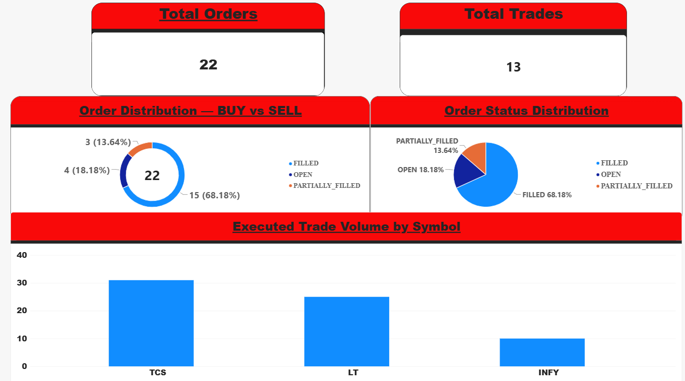
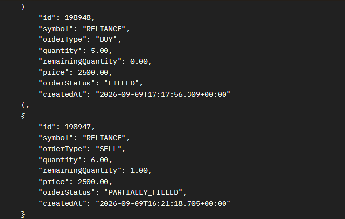
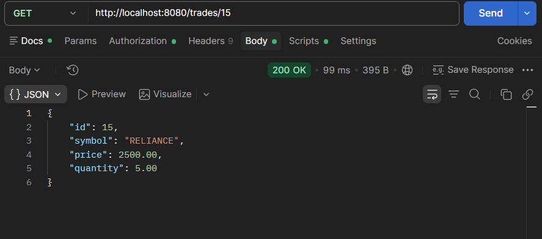

# Limit Order Book & Trade Execution Engine

A backend system that simulates the core order matching workflow of an electronic trading platform.

The system allows authenticated users to place BUY and SELL limit orders and automatically matches compatible orders using **Price-Time Priority**.

It supports partial fills, multiple executions, order status tracking, trade recording, transactional processing, JWT authentication, PostgreSQL persistence, and Power BI analytics.

---

## 🚀 Tech Stack

| Technology | Purpose |
|------------|---------|
| Java 21 | Backend development |
| Spring Boot | Application framework |
| Spring Web | REST APIs |
| Spring Data JPA | Database persistence |
| Hibernate | ORM |
| Spring Security | Authentication & API security |
| JWT | Stateless authentication |
| BCrypt | Password hashing |
| PostgreSQL | Relational database |
| Maven | Dependency management & build |
| Apache JMeter | Load testing |
| Power BI | Analytics & visualization |
| Postman | API testing |

---

## ✨ Key Features

- User registration
- Email-based login
- BCrypt password hashing
- JWT-based stateless authentication
- BUY and SELL limit orders
- Price-Time Priority matching
- Partial order execution
- Multiple executions for a single order
- Order status tracking
- Remaining quantity tracking
- Trade creation
- Transactional order processing
- Centralized exception handling
- PostgreSQL persistence
- REST APIs for order and trade retrieval
- Power BI analytics dashboard
- Apache JMeter load testing

---

## 📊 Analytics Dashboard

Power BI is connected to PostgreSQL to visualize trading activity.

The dashboard provides:

- Total Orders
- Total Trades
- BUY vs SELL Distribution
- Order Status Distribution
- Executed Trade Volume by Symbol

### Analytics Flow

```text
Spring Boot
     |
     v
PostgreSQL
     |
     v
Power BI
     |
     v
Analytics Dashboard
```

### Dashboard



---

## 🔄 Order Matching Flow

The **Limit Order Book & Trade Execution Engine** receives limit orders through REST APIs and processes them through the matching engine.

For every incoming order, the engine:

1. Identifies eligible opposite-side orders
2. Applies Price-Time Priority
3. Checks price compatibility
4. Calculates the matched quantity
5. Updates remaining quantities
6. Updates order statuses
7. Creates Trade records
8. Persists the changes within a database transaction

### High-Level Flow

```text
                    +----------------------+
                    |       Client         |
                    |      REST API        |
                    +----------+-----------+
                               |
                               v
                    +----------------------+
                    |   Spring Security    |
                    |   JWT Validation     |
                    +----------+-----------+
                               |
                               v
                    +----------------------+
                    |   Order Controller   |
                    +----------+-----------+
                               |
                               v
                    +----------------------+
                    |    Order Service     |
                    +----------+-----------+
                               |
                               v
                    +----------------------+
                    |   Matching Engine    |
                    |  Price-Time Priority |
                    +----------+-----------+
                               |
                    +----------+----------+
                    |                     |
                    v                     v
          +------------------+   +------------------+
          |   Order Entity   |   |  Trade Entity    |
          +--------+---------+   +--------+---------+
                   |                      |
                   +----------+-----------+
                              |
                              v
                    +----------------------+
                    |     PostgreSQL        |
                    +----------------------+
```

The current implementation processes order matching synchronously.

---

## ⚡ Price-Time Priority

The matching engine follows **Price-Time Priority**.

Priority is determined by:

```text
1. Best available price
2. Earlier order at the same price
```

### BUY Order

A BUY order can match when:

```text
BUY Price >= SELL Price
```

For a BUY order, the lowest compatible SELL price gets priority.

```text
Lower SELL price
        ↓
Higher priority
```

### SELL Order

A SELL order can match when:

```text
SELL Price <= BUY Price
```

For a SELL order, the highest compatible BUY price gets priority.

```text
Higher BUY price
        ↓
Higher priority
```

If multiple eligible orders have the same price, the earlier created order is considered first.

### Matching Example

Consider the following SELL orders:

```text
SELL Order #101
Price    = 2500
Quantity = 6

SELL Order #102
Price    = 2500
Quantity = 4
```

Now a BUY order arrives:

```text
BUY Order
Price    = 2500
Quantity = 5
```

The matching engine processes:

```text
BUY 5 @ 2500
      |
      v
SELL #101
6 @ 2500
      |
      v
Execute 5
      |
      +------------------+
      |                  |
      v                  v
BUY remaining = 0    SELL remaining = 1
FILLED              PARTIALLY_FILLED
```

A Trade record is created:

```text
Trade
Symbol   = RELIANCE
Price    = 2500
Quantity = 5
```

---

## 🧩 Partial & Multiple Execution

The engine supports partial fills when the quantities of matching orders are different.

For every match:

```text
Matched Quantity =
min(Incoming Remaining Quantity,
    Existing Remaining Quantity)
```

Example:

```text
BUY 10
  |
  +----> SELL 4  → Trade 4
  |
  +----> SELL 3  → Trade 3
  |
  +----> SELL 3  → Trade 3
```

Result:

```text
BUY Order
Original Quantity  = 10
Remaining Quantity = 0
Status             = FILLED
```

Three separate Trade records are generated.

### Order Lifecycle

Orders move through the following states:

```text
ORDER_PLACED
      |
      v
    OPEN
      |
      +----------------------+
      |                      |
      v                      v
PARTIALLY_FILLED          FILLED
      |
      v
    FILLED
```

| Status | Meaning |
|--------|---------|
| ORDER_PLACED | Order has been created |
| OPEN | Order has remaining quantity and is available for matching |
| PARTIALLY_FILLED | Part of the order has been executed |
| FILLED | Entire order quantity has been executed |

---

## 🔐 Security

The application uses **Spring Security with JWT-based stateless authentication**.

### Authentication Flow

```text
+----------+
|  Client  |
+----+-----+
     |
     | POST /login
     v
+------------+
| UserService|
+-----+------+
      |
      | Verify Email + Password
      v
+-------------+
| BCrypt Hash |
| Verification|
+------+------+
       |
       v
+-------------+
| JWT Service |
+------+------+
       |
       v
    JWT Token
       |
       v
    Client
```

For protected APIs:

```text
Client
  |
  | Authorization: Bearer <JWT>
  v
JwtAuthenticationFilter
  |
  v
Validate JWT
  |
  v
Spring Security
  |
  v
Protected Controller
```

### Public APIs

```text
POST /userRegistration
POST /login
```

### Protected APIs

All other business APIs require authentication.

### Security Measures

- JWT authentication
- Stateless sessions
- BCrypt password hashing
- Request validation
- Centralized exception handling
- Password excluded from JSON responses
- Sensitive values not logged

---

## 📡 API Overview

### User APIs

| Method | Endpoint | Description |
|--------|----------|-------------|
| POST | `/userRegistration` | Register user |
| POST | `/login` | Authenticate user and receive JWT |

### Order APIs

| Method | Endpoint | Description |
|--------|----------|-------------|
| POST | `/orders` | Place BUY / SELL order |
| GET | `/orders` | Retrieve all orders |
| GET | `/orders/{id}` | Retrieve order by ID |
| GET | `/orders/user/{userId}` | Retrieve orders by user |

### Trade APIs

| Method | Endpoint | Description |
|--------|----------|-------------|
| GET | `/trades` | Retrieve all trades |
| GET | `/trades/{id}` | Retrieve trade by ID |

### Order Processing

```text
POST /orders
      |
      v
JWT Authentication
      |
      v
Order Controller
      |
      v
Order Service
      |
      v
Matching Engine
      |
      v
Price-Time Priority
      |
      v
Order / Trade Updates
      |
      v
PostgreSQL
```

---

## 🗄️ Database

PostgreSQL is used as the primary relational database.

The core entities are:

```text
+----------------+
|     USERS      |
+----------------+
| id             |
| username       |
| email          |
| password       |
| availableBalance|
| blockedBalance |
| createdAt      |
| updatedAt      |
+-------+--------+
        |
        | 1
        |
        | N
        v
+----------------+
|     ORDERS     |
+----------------+
| id             |
| user_id        |
| symbol         |
| orderType      |
| quantity       |
| remainingQty   |
| price          |
| orderStatus    |
| createdAt      |
+-------+--------+
        |
        | 1
        |
        | N
        v
+----------------+
|     TRADE      |
+----------------+
| id             |
| symbol         |
| price          |
| quantity       |
| buy_order_id   |
| sell_order_id  |
+----------------+
```

### Transaction Management

Order placement and matching are processed inside a database transaction.

```text
POST /orders
      |
      v
Create Order
      |
      v
Matching Engine
      |
      +------> Update Orders
      |
      +------> Create Trade
      |
      v
Commit Transaction
```

If an unchecked failure occurs during transactional processing:

```text
Order Update
     +
Trade Creation
     +
Other DB Changes
     |
     v
   Failure
     |
     v
  Rollback
```

This prevents partially persisted database state.

---

## 🧪 Testing & Performance

### Functional Testing

The matching engine was tested using multiple scenarios:

- No matching order
- Exact order match
- Partial fill of existing order
- Partial fill of incoming order
- Multiple executions
- Price-Time Priority
- Order status transitions
- Trade creation

### Security Testing

Tested scenarios include:

- Successful registration
- Duplicate registration
- Successful login
- Invalid password
- Non-existent email
- Invalid login request validation
- Protected API access using JWT

### Transaction Testing

Rollback behavior was verified by intentionally triggering an unchecked failure during transactional processing and confirming that associated database changes were rolled back.

### Performance Testing

The application was load tested using **Apache JMeter**.

#### Test Configuration

```text
Concurrent Threads : 200
Iterations/Thread  : 250
Total Requests     : 50,000
Errors             : 0
```

#### Observed Results

```text
Total Requests : 50,000
Errors         : 0
Throughput     : 112.3 requests/second
Average Time   : 1,727 ms
Maximum Time   : 5,608 ms
```

These results were observed in the local development environment.

They represent an actual benchmark of the current synchronous implementation and are **not intended to represent production-scale high-frequency trading performance**.

---

## 📸 Screenshots

### Power BI Dashboard


### Order Matching Result

The following example demonstrates a partial fill:

```text
BUY RELIANCE
Quantity          = 5
Price             = 2500
Remaining         = 0
Status            = FILLED

SELL RELIANCE
Quantity          = 6
Price             = 2500
Remaining         = 1
Status            = PARTIALLY_FILLED
```



### Trade History

The resulting Trade record:

```text
Trade ID  = 15
Symbol    = RELIANCE
Price     = 2500
Quantity  = 5
```



---

## 📁 Project Structure

```text
Limit-Order-Book-Trade-Execution-Engine/
│
├── diagrams/
│
├── docs/
│   ├── 01_Project_Vision.md
│   ├── 02_Business_Requirements.md
│   ├── 03_Functional_Requirements.md
│   ├── 04_Non_Functional_Requirements.md
│   ├── 05_System_Architecture.md
│   ├── 06_Database_Design.md
│   ├── 06_Design_Decisions.md
│   ├── 07_API_Design.md
│   ├── 08_Matching_Engine_Design.md
│   ├── 09_Concurrency_Design.md
│   ├── 10_Security_Design.md
│   ├── 11_Analytics_Design.md
│   ├── 12_Testing_Strategy.md
│   └── 13_Future_Enhancements.md
│
├── postman/
│   └── Limit-Order-Book-Trade-Execution-Engine.postman_collection.json
│
├── screenshots/
│   ├── power-bi-dashboard.png
│   ├── order-matching-result.png
│   └── trade-history.png
│
├── sql/
│
├── src/
│
├── .gitignore
├── pom.xml
├── mvnw
├── mvnw.cmd
└── README.md
```

---

## ▶️ How to Run

### Prerequisites

Make sure the following are installed:

- Java 21
- PostgreSQL
- Maven / Maven Wrapper
- Postman

### Database Setup

Create the PostgreSQL database:

```sql
CREATE DATABASE hft_order_matching_engine;
```

Configure the database connection and JWT properties in the application's configuration.

Use environment variables or local configuration for sensitive credentials.

**Do not commit database passwords or JWT secrets to GitHub.**

### Start the Application

#### Windows

```bash
mvnw.cmd spring-boot:run
```

#### Linux / macOS

```bash
./mvnw spring-boot:run
```

The application runs on:

```text
http://localhost:8080
```

### Postman

A Postman collection is included in the `postman/` directory.

The collection covers:

```text
User Registration
       ↓
Login
       ↓
Receive JWT
       ↓
Place Orders
       ↓
Order Matching
       ↓
Retrieve Orders
       ↓
Retrieve Trades
```

The protected APIs should be called using the JWT received from the login API.

---

## 📚 Documentation

Detailed technical and business documentation is available in the `docs/` directory.

| Document | Purpose |
|----------|---------|
| `01_Project_Vision.md` | Project purpose and scope |
| `02_Business_Requirements.md` | Business-level requirements |
| `03_Functional_Requirements.md` | System behavior |
| `04_Non_Functional_Requirements.md` | Performance, security, reliability and quality requirements |
| `05_System_Architecture.md` | Application architecture |
| `06_Database_Design.md` | Database and entity design |
| `06_Design_Decisions.md` | Important technical decisions |
| `07_API_Design.md` | REST API specifications |
| `08_Matching_Engine_Design.md` | Matching algorithm and execution rules |
| `09_Concurrency_Design.md` | Current synchronous concurrency model |
| `10_Security_Design.md` | Authentication and security architecture |
| `11_Analytics_Design.md` | Power BI analytics design |
| `12_Testing_Strategy.md` | Functional, security and load testing |
| `13_Future_Enhancements.md` | Potential improvements beyond Version 1 |

---

## 📌 Version 1 Scope

The current implementation focuses on the core order matching workflow.

### Implemented

```text
User Registration
       ↓
JWT Authentication
       ↓
BUY / SELL Limit Orders
       ↓
Price-Time Priority
       ↓
Partial Fills
       ↓
Multiple Executions
       ↓
Trade Creation
       ↓
PostgreSQL Persistence
       ↓
Power BI Analytics
```

### Not Implemented in Version 1

- Balance reservation
- Trade settlement
- Portfolio / holdings management
- Deposits and withdrawals
- Market orders
- Stop-loss orders
- Order cancellation
- Live market data
- Asynchronous matching
- Distributed matching
- Kafka / event streaming
- Redis caching
- WebSocket live updates
- Microservices architecture
- Production-scale HFT optimization

These are considered future enhancements rather than current system capabilities.